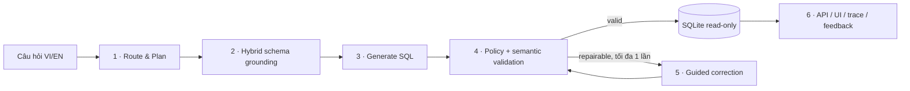

# Agentic Text-to-SQL — Local SQL Observatory

[](https://github.com/HelcurtLordno1/agentic-ai-textsql-learn/actions/workflows/ci.yml)

Hệ thống Agentic Text-to-SQL chạy **hoàn toàn local và miễn phí**: nhận câu hỏi tiếng Việt/Anh,
tìm schema liên quan, lập kế hoạch, sinh SQLite SQL, kiểm tra an toàn/ngữ nghĩa, thực thi read-only
và sửa tối đa một lần nếu lỗi có thể phục hồi. FastAPI, CLI và giao diện Streamlit dùng chung một
runtime; mọi run có trace sáu layer để kiểm tra thay vì chỉ hiện một câu trả lời “hộp đen”.

Specification và completion ledger chuẩn nằm tại
[`realistic_project_creation_codex.md`](realistic_project_creation_codex.md). Lịch sử bug và các
quyết định bonus gate nằm tại [`all_failures_in_project.md`](all_failures_in_project.md).

## Hệ thống làm gì?



- **Layer 1:** route write/unsupported/clarification trước model call; tạo logical plan có type.
- **Layer 2:** BM25 + BGE-M3/FAISS + RRF, chọn schema component có dimension/metric/FK phù hợp.
- **Layer 3:** Qwen3-14B local sinh một structured candidate với prompt/catalog provenance.
- **Layer 4:** SQLGlot AST policy, column/table ownership, SQLite authorizer, timeout/row/byte cap và
  semantic result checks.
- **Layer 5:** corrector gold-blind, bounded một repair; candidate sửa phải đi lại toàn bộ Layer 4.
- **Layer 6:** persistent run store, restart-safe SSE, CLI/FastAPI và năm workspace Streamlit.

Browser không được gửi filesystem path, chạy SQL tự sửa hoặc bypass policy. Runtime không import
gold benchmark data. Dữ liệu, database, index, trace, prediction, report chi tiết và model blobs đều
được Git-ignore.

## Trạng thái đã kiểm chứng

- Gate P0–P6 đã verified; bonus hardening P3.1, P5.1, P6.2 và P6.3 đã có evidence.
- `make check` gần nhất: Ruff lint/format sạch, mypy strict 105 source files, **175 tests pass** và
  một live-Ollama test được deselect đúng chủ ý.
- CI của commit `68fde00`: GitHub Actions run `31962809864` thành công.
- Live incident returning-customer hiện trả `2997` bằng SQL scalar đúng; revenue/freight ranking trả
  đúng năm rows bằng connected FK component.

Benchmark release P6 (revision `1509faa`, generator v4/corrector v3):

| Benchmark | Workflow | Accuracy | Holdout | P50 / P95 |
|---|---:|---:|---:|---:|
| Olist-60 bilingual | 60/60 | 57/60 = **95,00%** | 15/15 | 61,92 / 91,62 s |
| Spider-200, 20 DB | 200/200 | 130/200 = **65,00%** | 67/100 | 58,51 / 85,29 s |

Các score này là historical release evidence của revision đã khóa. Code hiện tại dùng generator v6
và corrector v5 sau hardening, nên **không kế thừa 95%/65%** cho tới khi chạy lại locked manifest.
Trong UI, “model confidence” không phải accuracy. Câu hỏi tự do chỉ có accuracy khi có independent
reference result. Xem [`benchmark_full.md`](benchmark_full.md) và
[`docs/evidence`](docs/evidence).

## Yêu cầu máy

Thiết lập đã kiểm chứng:

- Linux hoặc WSL2; Python **3.12.x**; Git; [`uv`](https://docs.astral.sh/uv/);
- [`Ollama`](https://ollama.com/) chạy local;
- model `qwen3:14b-q4_K_M` và `bge-m3:latest`;
- khoảng 25–35 GiB disk trống nếu cài cả models, Olist, Spider và indexes;
- NVIDIA GPU là tùy chọn nhưng nên có. Profile chuẩn đã đo trên RTX A4500 Laptop 16 GiB + khoảng
  24 GiB RAM. Máy khác phải pilot và tự hiệu chỉnh threshold, không copy mù power envelope này.

Không đặt virtualenv, database runtime hoặc index build temp trên `/mnt/c`/`/mnt/d` nếu có thể.
Source repository có thể ở đó, nhưng SQLite random I/O nhanh hơn rất nhiều trên WSL/Linux ext4.

## Cài mới trên máy khác

### 1. Clone và cài dependency

```bash
git clone https://github.com/HelcurtLordno1/agentic-ai-textsql-learn.git
cd agentic-ai-textsql-learn
uv python install 3.12
uv sync --frozen --extra ui --group dev
make check
```

`make check` không cần GPU, Ollama, Kaggle hay raw dataset. Nó dùng fake transports và synthetic
SQLite deterministic.

### 2. Cài model local và kiểm tra digest

```bash
ollama pull qwen3:14b-q4_K_M
ollama pull bge-m3:latest
ollama list
uv run text2sql doctor
uv run text2sql ollama-smoke
```

Runtime fail-closed nếu model tag trỏ tới digest khác `configs/models.yaml`. Đây là provenance
protection, không phải lỗi ngẫu nhiên. Digest đã verified:

- Qwen3: `bdbd181c33f2ed1b31c972991882db3cf4d192569092138a7d29e973cd9debe8`
- BGE-M3: `7907646426070047a77226ac3e684fbbe8410524f7b4a74d02837e43f2146bab`

Nếu upstream tag đã đổi, không sửa digest chỉ để vượt check. Hãy pin đúng artifact hoặc thực hiện
một model-upgrade gate và chạy lại live/evaluation evidence.

### 3. Tải và build Olist

```bash
uv run text2sql data download olist
uv run text2sql data build olist
uv run text2sql data validate olist
```

Downloader kiểm tra pinned ZIP và hash/header/count của chín CSV. Builder làm random-I/O trong
Linux temp, validate rồi mới atomic-publish `data/processed/olist.sqlite`. Có thể đặt pinned ZIP thủ
công tại `data/raw/olist/olist_brazilian_ecommerce.zip` nếu download endpoint không hoạt động.

### 4. Build semantic indexes đầy đủ

Script hiện tại dựng Olist và toàn bộ 20 Spider dev domains để đồng thời tạo evidence retrieval:

```bash
uv run python scripts/download_spider.py
uv run python scripts/create_spider_mini_manifest.py
uv run python scripts/build_indexes.py
```

Index immutable được lưu dưới `data/indexes/` và không commit. Nếu chỉ cần kiểm tra plumbing nhanh,
có thể bỏ bước này: runtime fallback về full registered catalog. Muốn chạy đúng grounded
architecture/reproduce benchmark thì indexes là bắt buộc.

### 5. Register database

```bash
uv run text2sql ingest --db data/processed/olist.sqlite --db-id olist
```

Catalog và run history được lưu local ở `data/artifacts/application.sqlite`. Chỉ `db_id` đã
register mới được API/UI truy vấn.

## Cheatsheet — chạy ứng dụng hoàn chỉnh

Mở ba terminal trong repository.

### Terminal 1 — Ollama có resource guard

```bash
uv run text2sql hardware-plan --profile interactive-balanced
uv run text2sql hardware-health --profile interactive-balanced
uv run python scripts/serve_ollama_guarded.py --profile interactive-balanced
```

Profile này dùng 6 GPU layers, 12 low-priority logical CPU cores, context 4096, parallelism 1,
Flash Attention, q8_0 KV cache và monitor fail-closed. Không tăng GPU layers chỉ dựa trên snapshot:
12/14/10/8-layer pilots từng chạm 108,02/137,65/101,93/113,77 W trong run dài.

Profile `cpu-fallback` vẫn dùng supervisor NVIDIA để quan sát máy đã kiểm chứng; nó chỉ đặt model
offload về CPU. Vì vậy chỉ dùng lệnh sau khi máy vẫn có `nvidia-smi` nhưng muốn tránh GPU compute:

```bash
uv run python scripts/serve_ollama_guarded.py --profile cpu-fallback
```

CPU fallback chậm hơn đáng kể. Trên máy hoàn toàn không có NVIDIA, guard hiện tại không dùng được
vì `hardware-health` cần `nvidia-smi`; chạy Ollama CPU-only có bounds cơ bản:

```bash
OLLAMA_NUM_PARALLEL=1 OLLAMA_MAX_LOADED_MODELS=1 OLLAMA_KEEP_ALIVE=0 \
OLLAMA_CONTEXT_LENGTH=4096 OLLAMA_HOST=127.0.0.1:11434 ollama serve
```

Và thêm `TEXT2SQL_OLLAMA_NUM_GPU=0` trước lệnh API ở Terminal 2. Đây là fallback chức năng, chưa có
fail-closed GPU telemetry như profile laptop đã verified.

### Terminal 2 — FastAPI

```bash
uv run text2sql serve --host 127.0.0.1 --port 8000
```

Kiểm tra:

```bash
curl http://127.0.0.1:8000/health
curl http://127.0.0.1:8000/catalogs
```

### Terminal 3 — Streamlit UI

```bash
uv run streamlit run apps/streamlit_app.py \
  --server.address 127.0.0.1 --server.port 8501
```

Mở <http://127.0.0.1:8501>. Streamlit file-watcher được tắt để tránh WSL poll làm treo HTTP; sau
khi sửa UI source hãy restart process thủ công. Drag organizer là opt-in vì dependency của nó làm
first render nặng hơn; keyboard selector luôn dùng được.

### Chạy một câu hỏi bằng CLI

```bash
uv run text2sql ask \
  --db-id olist \
  --question "Có bao nhiêu khách hàng quay lại theo customer_unique_id?" \
  --correction
```

Lưu ý: API/UI bật correction mặc định; CLI chỉ bật khi có `--correction`.

### Gọi API trực tiếp

```bash
curl -X POST http://127.0.0.1:8000/queries \
  -H 'Content-Type: application/json' \
  -d '{"db_id":"olist","question":"Top 5 danh mục theo doanh thu sản phẩm, tách phí vận chuyển","correction_enabled":true}'
```

Response `202` chứa `run_id` và `events_url`. Dùng `GET /queries/{run_id}` để lấy kết quả hoặc
`GET /queries/{run_id}/events` để xem SSE trace.

### Dừng sạch

Nhấn `Ctrl+C` lần lượt ở UI, API và guarded Ollama. Supervisor quản lý cả Ollama process group;
không cần kill GPU process thủ công.

## Cheatsheet — kiểm thử và benchmark

```bash
# Gate kiểm tra bắt buộc trước commit
make check

# Live provider contract
uv run text2sql doctor
uv run text2sql ollama-smoke

# Direct/grounded Olist smoke
uv run python scripts/run_smoke.py --mode grounded --correction on

# Olist-60 checkpointed
uv run python scripts/serve_ollama_guarded.py --profile acceptance-safe
uv run python scripts/run_guarded_acceptance.py --profile acceptance-safe

# Spider-200: luôn pilot đúng một case trước
uv run python scripts/create_spider_laptop_manifest.py
OLLAMA_BASE_URL=http://127.0.0.1:11434 TEXT2SQL_OLLAMA_NUM_GPU=6 \
  uv run python scripts/run_benchmark.py \
  --manifest evals/configs/spider-laptop-200.json \
  --predictions evals/predictions/spider-p6-200-gpu6.jsonl \
  --report evals/reports/spider-p6-200.json \
  --correction --resume --max-new-cases 1

# Sau khi pilot và supervisor đều khỏe
OLLAMA_BASE_URL=http://127.0.0.1:11434 TEXT2SQL_OLLAMA_NUM_GPU=6 \
  uv run python scripts/run_guarded_spider.py \
  --profile interactive-balanced --batch-size 10 --cooldown-seconds 20 \
  --manifest evals/configs/spider-laptop-200.json \
  --predictions evals/predictions/spider-p6-200-gpu6.jsonl \
  --report evals/reports/spider-p6-200.json
```

Không chạy full Spider-1.034 liên tục trên laptop này. Profile full có tại
`evals/configs/spider-release-1034.json` cho workstation/server hoặc nhiều phiên cooled-resume.
Prediction được atomic-checkpoint sau từng case; guard stop rồi `--resume` là hành vi bình thường.

## Biến môi trường hữu ích

| Biến | Mặc định | Dùng khi nào |
|---|---|---|
| `OLLAMA_BASE_URL` | `http://127.0.0.1:11434` | Ollama local ở port khác |
| `TEXT2SQL_API_URL` | `http://127.0.0.1:8000` | UI gọi API port khác |
| `TEXT2SQL_DATA_DIR` | `<repo>/data` | Đặt data/index trên Linux disk khác |
| `TEXT2SQL_ARTIFACT_DIR` | `<data>/artifacts` | Đổi nơi lưu run store/report local |
| `TEXT2SQL_RUNTIME_CACHE_DIR` | `/tmp/agentic-text2sql-runtime` | Chọn ext4 cache bền/nhanh hơn |
| `TEXT2SQL_OLLAMA_NUM_GPU` | profile hoặc Ollama tự chọn | Chỉ override sau guarded pilot |
| `TEXT2SQL_RUN_DEADLINE_SECONDS` | `120` | Hard bound 30–180 giây |
| `TEXT2SQL_OLLAMA_SEED` | `42` | Reproducible generation seed |

Không commit `.env` hoặc secret. Project không cần paid API key.

## Chẩn đoán nhanh

| Triệu chứng | Kiểm tra/giải pháp |
|---|---|
| `connection refused :11434` | Khởi động guarded Ollama; chạy `doctor` |
| Model digest mismatch | So `ollama list` với `configs/models.yaml`; không bypass pin |
| API báo catalog không tồn tại | Chạy lại `text2sql ingest ... --db-id olist` |
| `UNKNOWN_COLUMN` / `INVALID_SQL` | Xem Run Inspector: schema context, attempted SQL, validation và repair outcome |
| UI port mở nhưng trang treo | Xác nhận `.streamlit/config.toml` dùng `fileWatcherType="none"`; restart UI |
| Query SQLite chậm trên WSL | Giữ `TEXT2SQL_RUNTIME_CACHE_DIR` ở `/tmp`/ext4, không ở `/mnt/*` |
| GPU power/RAM vượt ngưỡng | Để supervisor dừng; resume checkpoint; không tăng layers/threshold tùy tiện |
| UI hiện 95% | Đọc nhãn: đó có thể là model confidence, không phải measured accuracy |
| Benchmark bị ngắt | Giữ nguyên commit/digest/config và chạy lại với `--resume` |

## Safety, data và licensing

Project source dùng MIT License. Dataset/model có license riêng; xem
[`data/README.md`](data/README.md) và
[`docs/data/license_and_attribution.md`](docs/data/license_and_attribution.md). API/UI chỉ được thiết
kế cho loopback local; chưa có authentication, TLS, rate limiting hoặc multi-user isolation nên
không expose ra Internet.

Các tài liệu vận hành chi tiết:

- [`docs/runbook.md`](docs/runbook.md) — quy trình gate/benchmark đầy đủ;
- [`docs/architecture.md`](docs/architecture.md) — boundaries và contracts;
- [`docs/threat_model.md`](docs/threat_model.md) — safety model;
- [`docs/error_analysis.md`](docs/error_analysis.md) — benchmark failure taxonomy;
- [`all_failures_in_project.md`](all_failures_in_project.md) — toàn bộ incident và bài học theo gate.
