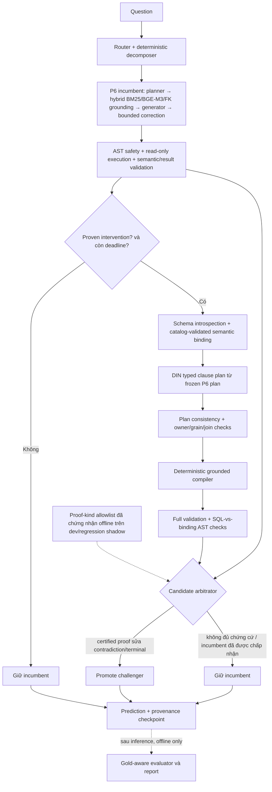

# Paper II so với baseline P6: kiến trúc hiện tại và Olist 58/60

**Cập nhật:** 2026-09-17 (Asia/Bangkok)

**Trạng thái:** R2 `IN_PROGRESS`; P6 vẫn là default/champion đã được release

**Quyết định:** giữ Paper II làm research opt-in đến khi có fresh guarded blind run và Spider paired evaluation. Không biến hai lỗi Olist đã lộ thành luật riêng để theo đuổi 60/60.

## 1. Kết luận điều hành và ranh giới bằng chứng

Baseline P6 lịch sử đạt **57/60 (95,00%)** trên Olist-60. Kết quả Paper II hiện có là **58/60 (96,67%)**, hơn một case hay 1,67 điểm phần trăm, trong báo cáo `r2-relational-recovery-v2-combined-olist60`. Đây là **adaptive recovery**, không phải 60 inference độc lập trên một source snapshot: lượt v1 giữ 37 success từ run bị ngắt và suy luận 23 case; lượt v2 giữ 54 success từ v1 và suy luận lại sáu failure. SHA-256 của từng prediction được giữ đã được kiểm tra trước merge. Vì vậy 58/60 chứng minh recovery cuối được evaluator chấm đúng 58 case, **không đủ để claim fresh blind improvement hoặc Spider gain**.

So từng case với baseline, Paper II sửa **014, 023, 038** nhưng làm sai **043, 048** vốn đúng ở P6: net **+1**. Cụm từ “giữ nguyên success” chỉ đúng cho **54 success của recovery v1 sang v2**, không đúng nếu hiểu là giữ toàn bộ 57 success của P6. Hai lỗi 043/048 đã được quan sát, nên Olist holdout cũ không còn là nguồn bằng chứng blind cho bất kỳ sửa đổi tiếp theo.

Arbitration log cho thấy 014 `SKIP_CHALLENGER`, còn 023/038 `KEEP_INCUMBENT`; cả ba gain paired so P6 là **output của incumbent trong một run khác**, chưa quy được nguyên nhân cho typed challenger. Ngược lại, 035/039/040 và 045/046/054/059 có `PROMOTE_CHALLENGER` kèm certified proof sửa contradiction của incumbent trong chính run đó. Đây là khác biệt quan trọng giữa *chênh lệch điểm quan sát* và *tác động kiến trúc có evidence*.

Các thành phần hỗ trợ proof đã được triển khai theo operator, owner, grain và SQL AST thay vì case ID/gold SQL/hardprompt. Đó là *thiết kế chống benchmark-specific leakage*, không phải lời bảo đảm rằng mô hình không overfit hoặc sẽ tăng điểm Spider. Spider chỉ có thể được kết luận bằng run paired riêng trên manifest đã khóa.

## 2. Số liệu đối chiếu

| Chỉ số | P6 baseline lịch sử | R2 recovery v1 | R2 recovery v2 |
|---|---:|---:|---:|
| Phương pháp | frozen full Olist-60 | adaptive, 37 giữ + 23 suy luận | adaptive, 54 giữ + 6 suy luận |
| Result-correct | **57/60 (95,00%)** | 54/60 (90,00%) | **58/60 (96,67%)** |
| First-pass correct | 51/60 | 44/60 | 48/60 |
| Correction recovered / attempted | 6/6 | 10/13 | 10/12 |
| Typed terminal / valid candidate | 60/60 / 60/60 | 60/60 / 60/60 | 60/60 / 60/60 |
| Dev | 28/30 | 30/30 | 30/30 |
| Regression | 14/15 | 13/15 | 14/15 |
| Holdout lịch sử | 15/15 | 11/15 | 14/15 |
| English | 28/30 | 27/30 | 29/30 |
| Vietnamese | 29/30 | 27/30 | 29/30 |
| Easy / medium / hard | 34/37 · 21/21 · 2/2 | 34/37 · 18/21 · 2/2 | 36/37 · 20/21 · 2/2 |
| P50 / P95 latency mỗi prediction | 61,92 / 91,62 s | 66,27 / 91,93 s | 58,77 / 93,47 s |

Latency không phải phép đo speedup có kiểm soát: ba cột khác source revision, phần prediction tái sử dụng, trạng thái model và điều kiện GPU. P50/P95 cũng không gồm cooldown giữa batches hay tổng wall-clock của benchmark. First-pass ở v2 vẫn thấp hơn P6 ba case; tỷ lệ result-correct cao hơn không đồng nghĩa mọi thuộc tính đều cải thiện.

Đối chiếu đúng cặp trên 60 ID với P6:

```text
P6 57 correct
  +3: 014, 023, 038 được sửa
  -2: 043, 048 bị regression
  = R2 adaptive 58 correct
```

Mốc Paper II cũ `olist-r2e-proof-compiler-v1` dừng 28/31 theo accuracy kill criterion, upper bound 57/60. Mốc đó là một revision trước kiến trúc champion--challenger hiện tại; không được cộng hoặc so latency trực tiếp với report 58/60.

## 3. Kiến trúc Paper II hiện tại

Paper II không thay toàn bộ P6 bằng một specialist. Nó chạy incumbent P6 trước, giữ logical plan/candidate/result, rồi chỉ mở một challenger khi admission có **typed semantic proof** và còn deadline. Challenger dùng schema introspection, semantic catalog được validate theo catalog hash, source grain, typed clause plan và deterministic grounded compiler. Cả hai đi qua chính sách SQL AST, read-only execution và validation; arbitrator quyết định bằng proof obligations và certification, không bằng gold hay model confidence.



| Thành phần | Hợp đồng/giới hạn quan trọng | Code chính |
|---|---|---|
| Reasoning và route | Giữ P6 plan; specialist chỉ vào khi dependency/semantic proof có cơ sở | `layer1_reasoning/adaptive_routing.py`, `planner.py` |
| Grounding | Catalog hash, table/column owner, FK và source grain; Olist business metadata là adapter tùy chọn | `layer2_grounding/service.py`, `semantic_catalog.py` |
| Proof và generation | Typed aggregate, frequency ranking, relational join/comparison/group; deterministic SQL từ contract đã chứng minh | `contracts/semantics.py`, `layer3_generation/easy_compiler.py` |
| Validation và correction | SQLGlot AST kiểm lineage/obligations; read-only SQLite; bounded correction và deadline | `layer4_validation/binding_validator.py`, `executor.py`, `layer5_correction/` |
| Arbitration | Shadow luôn giữ incumbent; enforce chỉ promote certified deterministic proof khi incumbent có contradiction/terminal | `layer6_application/champion_challenger.py` |
| Evaluation | Predictions được ghi trước khi gold-aware evaluator mở expected results; runtime không import evaluator | `agentic_text2sql_eval/`, `scripts/run_r2_olist_recovery.py` |

Certification từ shadow dev/regression của `r2-proof-complete-v4` ghi 23/23 challenger proofs đúng, bảy improvement, zero regression trên **tập shadow được admit**; allowlist gồm `aggregate:avg`, `count_distinct`, `count_rows`, `max`, `sum` và `frequency_ranking`. Đây là điều kiện *cho phép can thiệp*, không phải độ chính xác toàn suite hay giấy bảo đảm với mọi schema. `MIN` chưa nằm trong allowlist.

## 4. Các chỉnh sửa trọng điểm project để đạt điểm 58/60

### 4.1 Giữ incumbent và chỉ promote challenger khi có proof

Revision cũ có thể bỏ một P6 candidate đúng để đổi lấy specialist thất bại. Kiến trúc hiện tại chạy P6 trước, admission có deadline, shadow để quan sát, và enforce chỉ chọn deterministic challenger đã full-validation khi proof kind được chứng nhận và chỉ ra contradiction cụ thể ở incumbent. Specialist exception/timeout/binding incomplete giữ P6 result. Không best-of-N, không thêm model self-judge hay confidence threshold đoán đúng/sai.

### 4.2 Chuẩn hóa semantic ownership và grain xuyên các layer

Resolver xác định population table, metric owner, identity và row grain trước compiler. `COUNT_DISTINCT` phải dùng dimension thuộc entity đúng (`customer_state`, không phải `customer_unique_id` chỉ vì cùng bảng). `per order`, raw payment/review row và derived one-row-per-order view là các grain khác nhau. Validator kiểm AST lineage của view/column theo cùng typed binding, thay vì đòi literal phrase xuất hiện trong SQL cuối. Null/status/ordered predicate chưa biểu diễn được thì fail-closed.

### 4.3 Relational proof và SQL compiler có giới hạn

H11 thêm join cardinality `ONE_TO_ONE`/`MANY_TO_ONE`, alternate metric source đúng grain, column-to-column comparison và grouped aggregate ranking. Compiler chỉ biên dịch join path đã catalog-validated; validator kiểm đủ owner, join, comparison, group, order và limit trước arbitration. Điều này sửa các lỗi R2 nội bộ **035/039/040** (product category không tồn tại ở per-order item totals, thiếu correlation/order-grain comparison, và đếm payment rows thay vì giao hai aggregate tables). Ba case này đã đúng ở baseline P6; chúng là *recovery khỏi regression của R2*, không được tính là ba gain paired so P6.

H12 thêm typed anti-join trên quan hệ one-to-one cho **045/046**: `LEFT JOIN` và `right.order_id IS NULL`, đếm base order rows. Thêm metric AVG `payment_installments` đúng raw payment grain cho **054** và frequency ranking theo `payment_type` raw payment rows cho **059**. Bốn case này sai ở recovery v1 và đúng ở v2; model-free exact-result replay và paraphrase tests cũng pass. Rule mô tả toán tử/owner/grain, không chứa case ID, gold SQL, expected row hay nguyên câu benchmark.

### 4.4 Bảo toàn checkpoint và giảm I/O, không nới laptop guard

Recovery runner audit report source với status/SQL/rows, khóa SHA-256 từng dòng success và cấm ghi đè success seed. V1 giữ 37/37, V2 giữ 54/54 prediction byte-identical; final evaluator chấm đủ 60 ID. Guarded runner stage và xác minh SHA-256 SQLite một lần mỗi invocation, cache catalog snapshot cho child one-case batches và đánh giá cuối trên WSL-native filesystem; đây là tối ưu I/O/latency vận hành, **không đổi câu hỏi, prompt hay logic chấm**. Vẫn batch 1, GPU layer 1, unload models, sampling 0,5 giây và cooldown 60 giây.

### 4.5 Chuyển biến quan sát được và giới hạn

| Nhóm case | Nguyên nhân/giải pháp | Ý nghĩa bằng chứng |
|---|---|---|
| 014, 023, 038 | Output mới lần lượt trả full distribution, distinct đúng dimension và status + non-null; arbitration giữ incumbent | Ba gain paired so P6 **được quan sát**, nhưng không quy nhân quả cho challenger |
| 035, 039, 040 | Relational proof, join/column comparison, cardinality-safe grouped source | Sửa regression phát sinh trong R2, không phải gain so P6 |
| 045, 046, 054, 059 | Anti-join, AVG raw installments, payment-type frequency | Bốn gain từ recovery v1 → v2, không mất 54 success cũ |
| 043, 048 | Temporal month ranking còn thiếu typed projection; raw review `MIN` chưa có proven binding/certification | Hai regression so P6 vẫn tồn tại; **không tuyên bố 60/60** |

Hai case 043/048 đã được xem chi tiết. Viết rule đúng hai câu hỏi đó hoặc ép model bằng hardprompt sẽ làm suy yếu benchmark và không chứng minh transfer. Nếu sau này bổ sung month-bucket hoặc raw-row-grain `MIN`, phải thiết kế bằng schema-derived operator, kiểm thử nhiều schema/paraphrase/adversarial cases và chứng nhận độc lập trước khi promote; Olist 60/60 sau khi xem lỗi chỉ còn là diagnostic.

## 5. Phương pháp chạy, tính an toàn và provenance

| Mốc | Prediction được giữ | Inference mới | Kết quả và vai trò |
|---|---:|---:|---|
| `r2-proof-complete-v4` enforce prefix | — | 40/60 | 37/40; nguồn cho recovery, không phải full score |
| `r2-relational-recovery-v1` | 37 | 23 | 54/60; hoàn tất manifest lần đầu |
| `r2-relational-recovery-v2` | 54 | 6 | 58/60; sửa bốn lỗi mới, merge đủ 60 |

V2 có `source_digest=06cff83a7bdf8549a91b3be0506a0c30e1612e8ac0dbf71e3158462ec71c0eca`; source v1 có digest khác. Provenance ghi `adaptive_recovery_not_blind`, source artifact hashes, 54 preserved IDs và sáu inferred IDs. Report v2 và prediction v2 có SHA-256 lần lượt `0870a0cc14cc5d9be66e507310807625cdddd419c72b99d04d2e388486bd3aeb` và `b6ae8e2bba8214fb838772905a5198f983cd5c9ec185b084a0a6633c83c11758`. Baseline P6 report SHA-256 là `26fbb521ac3d693258429e6a22ba6847602ac3c0874dec4182618ad81264064e`.

Run dùng profile `olist-paper1-ultrasafe`: Administrator hard clock cap 300–600 MHz, explicit Qwen3-14B `num_gpu=1`, batch 1, một model resident, unload/cooldown 60 giây, sampling liên tục 0,5 giây. Qua pilot và continuation v2, peak guard là **2.178 MiB VRAM, 56 °C, 63,98 W, RAM used 1,219 GiB, swap 0**; không có resource-stop lock. Tmux benchmark exit 0 và server đã dừng. Không hạ cooldown xuống 40–45 giây vì profile ngoại lệ bắt buộc 60 giây.

Các artifact so sánh giữ ở local/ignored `evals/`:

- P6: `evals/reports/olist-p6-60.json`, `evals/predictions/olist-p6-60.jsonl`;
- Paper II shadow/progress/certification: `evals/reports/r2-proof-complete-v4-shadow-dev-regression.json`, `r2-proof-complete-v4-enforce-olist60.progress.json`, `r2-proof-complete-v4.certification.json` cùng provenance/predictions;
- Recovery v1/v2: `evals/reports/r2-relational-recovery-v1-combined-olist60.json`, `r2-relational-recovery-v2-combined-olist60.json` cùng provenance, prediction và logs;
- Spider P6 đối chứng: `evals/reports/spider-p6-200.json` và manifest/predictions của nó.

## 6. Spider transfer và quyết định nghiên cứu

P6 Spider-200 lịch sử đạt **130/200** (regression 63/100, holdout 67/100). Paper II hiện **chưa chạy Spider paired**, nên không thể nói 58/60 Olist làm Spider tốt hơn. Các phép toán có tiềm năng chuyển miền là aggregate, `COUNT_DISTINCT`, frequency/grouped ranking, anti-join, PK/FK/cardinality, nullability và SQL AST lineage. Olist aliases, status values và business views chỉ là domain metadata; Spider không được phụ thuộc chúng.

Trước khi cân nhắc promote R2: freeze source/prompt/catalog; chạy fresh guarded Olist blind với ID mới, rồi Spider trên manifest/budget/model/hardware cố định so từng case với P6. Báo riêng gains, regressions, complexity/database slices, latency và resources. Nếu Spider không cải thiện hoặc có regression đáng kể, giữ P6 làm default dù Olist adaptive đạt 58/60. Không dùng Spider aggregate score để che lỗi grain, và không dùng gold/benchmark ID làm tín hiệu runtime.

## 7. Verification và quản trị artifact

Sau H12, `make check` pass Ruff, format, strict mypy trên 114 source files và **340 non-Ollama tests** (1 deselected); `uv lock --check` và `uv pip check` pass, 83 packages compatible. Model-free replay chấm exact results của các typed proof mới; local-model benchmark chỉ chạy qua guarded wrapper. Core vẫn local/free, không thêm paid SDK hay API key.

Đợt dọn `evals/` chỉ bỏ **tám JSON trung gian trùng dữ liệu**, không bỏ baseline, Paper II progress, certification/provenance, predictions, final combined reports, resource-stop incidents hay Spider artifacts. Hai `*.seed-audit.json` là bản copy của source report sau khi bỏ metadata audit; sáu one-case pilot `*.json` có payload tương đương `*.progress.json` (khác `evaluation_id`/định dạng số) và progress được giữ. File được đưa vào Trash để có thể khôi phục. Không dọn bằng wildcard hoặc xóa hàng loạt cả `evals/reports`.

Tám tên đã dọn, đều dưới `evals/reports/`: `r2-relational-recovery-v1.seed-audit.json`, `r2-relational-recovery-v2.seed-audit.json`, `olist-r2c-din-route-pilot-v1.json`, `olist-r2c-typed-compiler-pilot-v1.json`, `olist-r2h-din-fallback-case030-pilot-v1.json`, `olist-r2h-grain-proof-case030-pilot-v2.json`, `olist-r2h-lineage-case031-pilot-v4.json`, `olist-r2h-typed-frequency-case020-pilot-v3.json`. Payload và `.trashinfo` đã được xác nhận tại `/mnt/d/.Trash-1000/` để phục hồi nếu cần.

## 8. Claim boundary

- **Đã đo:** P6 Olist 57/60; R2 adaptive 58/60; paired +3/−2; recovery v1 → v2 +4 với 54/54 success được giữ nguyên.
- **Chưa chứng minh:** R2 fresh blind 58/60, monotonic non-regression so P6 trên mọi case/lần chạy, hoặc Spider >130/200.
- **Không claim:** 60/60, không overfitting tuyệt đối, giảm p95 có kiểm soát, hay khả năng transfer từ Olist business rules sang Spider.
- **Gate:** R2 tiếp tục `IN_PROGRESS`; P6 vẫn default/champion cho tới khi vượt fresh Olist và paired Spider gate.
