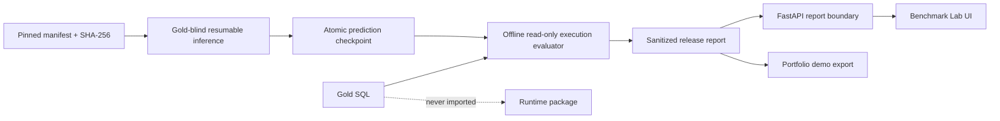

# Architecture

The canonical six-layer design and completion ledger live in
`realistic_project_creation_codex.md`. Runtime dependencies point inward and gold-aware evaluation
is a one-way outer adapter:

```text
contracts <- layer services <- bounded workflow <- CLI/API/UI
                     ^                 |
                  adapters <-----------+

agentic_text2sql_eval -> runtime public contracts/results
runtime -X-> evaluator, gold SQL, benchmark answers
```

The P6 verified path remains the frozen benchmark baseline. The active Paper II branch adds a
research path before generation:

```text
Question -> Router -> Decomposer
         -> BM25 + BGE-M3/FAISS -> compact connected SchemaContext
         -> SemanticLinkPlan(entity/metric/dimension/filter/value + evidence owner)
         -> Qwen3 DIN planner -> ComplexityDecision + typed ClausePlan
         -> deterministic PlanConsistencyValidator
         -> strategy-specific Qwen3 Generator -> SQLGlot policy -> read-only bounded SQLite
         -> optional one-shot correction -> full policy/validation re-entry
         -> persistent result + six-layer trace -> CLI / FastAPI / Streamlit
```

Schema linking precedes semantic planning as in DIN-SQL. `EASY` plans stay minimal,
`NON_NESTED` plans enumerate physical joins, and `NESTED` plans carry ordered subquery dependencies.
The runtime still uses one planner call and one generator call; it does not run long chain-of-thought
prompts or multiple candidates. Exact-name lookup joins not declared as FKs are admitted only when
both sides are raw tables and exactly one side is a primary/unique key, and are labeled
`INFERRED_UNIQUE_LOOKUP` in provenance.

`TEXT2SQL_PLANNING_MODE=baseline|hybrid|din_sql` makes the ablation path explicit. Baseline mode
selects the frozen v2/v4/v3 prompts. Hybrid uses deterministic grounded planning, sends EASY or
advisory-conflict plans through compact baseline generation/correction, and reserves DIN prompts for
validated multi-join/nested plans. DIN-SQL mode selects v3/v5/v4 prompts and refuses to start without an active
semantic index. Routing, catalog hashing, retrieval fusion, graph closure, plan validation, budgets,
policy and evaluation are deterministic. Every grounded candidate retains catalog/model/prompt
identity, evidence IDs, planning mode and the plan-validation report.

The Paper II implementation has deterministic test evidence, but it is not promoted or marked
`VERIFIED` until a guarded paired benchmark meets Gate R2 accuracy and latency thresholds.

The application boundary uses one `ApplicationQueryService`. CLI invokes it synchronously; FastAPI
submits to a one-worker executor and exposes restart-safe SSE; Streamlit calls only the API and has
no SQLite or policy bypass. The server accepts registered `db_id` values, never arbitrary request
paths. Runs, trace events, feedback, and catalog snapshots share a local WAL-enabled SQLite state
file under ignored artifacts.

Index publication never mutates the active bundle. A deterministic version ID addresses an
immutable directory; an atomic JSON pointer activates it only after checksums and FAISS shape are
complete. Generated indexes, caches and predictions remain ignored. The application may run fully
offline after pinned datasets and local Ollama models are present.

## Release evidence flow



P6 groups the laptop-stratified Spider-200 profile by database to reuse the catalog/index while
preserving a manifest prefix for crash-safe resume. Regression-100 and disjoint holdout-100 remain
separate report slices. The same harness can run full Spider-1034 as optional P6.1 on stronger
hardware. The evaluator opens gold only after all runtime contexts close, executes both queries with
SQLite `query_only` and a deadline, normalizes unordered result multisets and column permutations up
to width eight, and records hashes rather than gold rows in the report.

Release inference is pinned to seed 42, configured Qwen/BGE digests, and one clean Git commit.
Resume refuses predictions from another revision; per-database index/catalog provenance is
checkpointed atomically beside predictions. Evaluator result materialization is capped so an
incorrect cross join cannot exhaust laptop memory.

Post-inference evaluators report clause-presence F1, clause exact rate, table/column/join recall,
and plan-to-SQL clause agreement when a typed DIN-SQL plan is present. Gold SQL is still opened only
after inference has stopped; runtime code does not import the evaluator.
