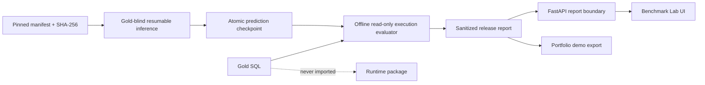

# Architecture

The canonical six-layer design and completion ledger live in
`realistic_project_creation_codex.md`. Runtime dependencies point inward and gold-aware evaluation
is a one-way outer adapter:

```text
contracts <- layer services <- bounded workflow <- CLI/API/UI
                     ^                 |
                  adapters <-----------+

agentic_text2sql_eval -> runtime public contracts/results
runtime -X-> evaluator, gold SQL, benchmark answers
```

The verified application path is:

```text
Question -> Router -> Decomposer -> LogicalPlan
         -> BM25 + BGE-M3/FAISS -> equal-weight RRF
         -> plan-aware minimal FK closure -> serialized budgeted SchemaContext
         -> Qwen3 Generator -> SQLGlot policy -> read-only bounded SQLite
         -> optional one-shot correction -> full policy/validation re-entry
         -> persistent result + six-layer trace -> CLI / FastAPI / Streamlit
```

Routing, catalog hashing, retrieval fusion, graph closure, budgets, policy and evaluation are
deterministic. LLM calls are limited to typed planning/generation and, only when explicitly
enabled, one bounded correction call. Every grounded candidate retains catalog/model/prompt
identity and evidence IDs.

The application boundary uses one `ApplicationQueryService`. CLI invokes it synchronously; FastAPI
submits to a one-worker executor and exposes restart-safe SSE; Streamlit calls only the API and has
no SQLite or policy bypass. The server accepts registered `db_id` values, never arbitrary request
paths. Runs, trace events, feedback, and catalog snapshots share a local WAL-enabled SQLite state
file under ignored artifacts.

Index publication never mutates the active bundle. A deterministic version ID addresses an
immutable directory; an atomic JSON pointer activates it only after checksums and FAISS shape are
complete. Generated indexes, caches and predictions remain ignored. The application may run fully
offline after pinned datasets and local Ollama models are present.

## Release evidence flow



P6 groups the laptop-stratified Spider-200 profile by database to reuse the catalog/index while
preserving a manifest prefix for crash-safe resume. Regression-100 and disjoint holdout-100 remain
separate report slices. The same harness can run full Spider-1034 as optional P6.1 on stronger
hardware. The evaluator opens gold only after all runtime contexts close, executes both queries with
SQLite `query_only` and a deadline, normalizes unordered result multisets and column permutations up
to width eight, and records hashes rather than gold rows in the report.

Release inference is pinned to seed 42, configured Qwen/BGE digests, and one clean Git commit.
Resume refuses predictions from another revision; per-database index/catalog provenance is
checkpointed atomically beside predictions. Evaluator result materialization is capped so an
incorrect cross join cannot exhaust laptop memory.
